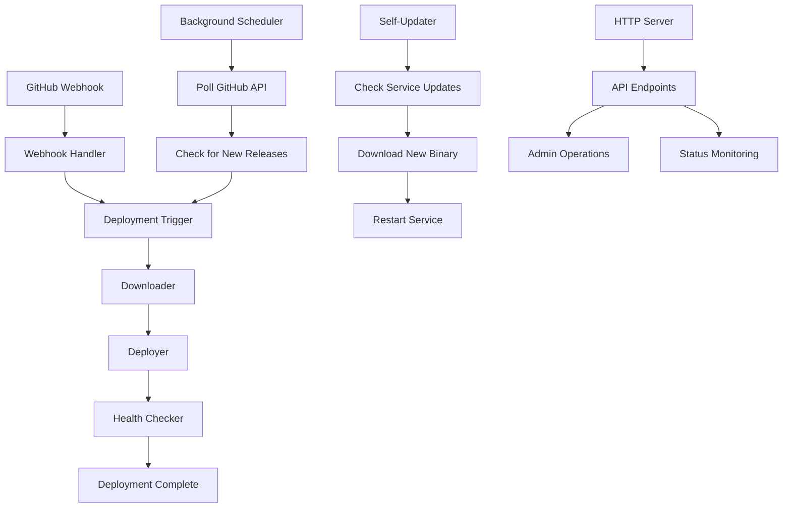

# Abu Service Development Guide

This guide covers setting up a development environment for the Abu Service, understanding the codebase, and contributing to the project.

## 🏗️ Development Environment Setup

### Prerequisites

- **Rust 1.75+** with Cargo
- **Git** for version control
- **Docker** and **Docker Compose** (optional, for containerized development)
- **Node.js 20+** (for testing webhook integrations)
- **GitHub CLI** (optional, for repository management)

### Quick Start

```bash
# Clone the repository
git clone https://github.com/your-username/abu-service.git
cd abu-service

# Install Rust dependencies
cargo build

# Run tests
cargo test

# Start development server
cargo run -- --config config.toml
```

### Development Dependencies

```bash
# Install development tools
cargo install cargo-watch cargo-tarpaulin cargo-audit cargo-outdated

# Install additional tools
cargo install toml-cli  # For TOML validation
cargo install cargo-expand  # For macro expansion
```

## 📁 Project Structure

```
abu-service/
├── src/                          # Source code
│   ├── main.rs                   # Application entry point
│   ├── lib.rs                    # Library root and public API
│   ├── config.rs                 # Configuration management
│   ├── github/                   # GitHub integration
│   │   ├── mod.rs                # Module declarations
│   │   ├── api.rs                # GitHub API client
│   │   └── webhook.rs            # Webhook handling
│   ├── deployment/               # Deployment logic
│   │   ├── mod.rs                # Module declarations
│   │   ├── downloader.rs         # Asset downloading
│   │   ├── deployer.rs           # Deployment execution
│   │   └── health.rs             # Health checking
│   ├── server/                   # HTTP server
│   │   └── mod.rs                # Axum server and routes
│   ├── updater/                  # Self-update functionality
│   │   ├── mod.rs                # Module declarations
│   │   ├── self_update.rs        # Self-update logic
│   │   └── scheduler.rs          # Background task scheduling
│   ├── storage/                  # State management
│   │   └── mod.rs                # Application state
│   └── mocks/                    # Mock implementations
│       ├── mod.rs                # Mock module declarations
│       └── github_client.rs      # Mock GitHub client
├── tests/                        # Integration tests
│   ├── config_test.rs            # Configuration tests
│   ├── github_test.rs            # GitHub API tests
│   ├── deployment_test.rs        # Deployment tests
│   ├── integration_test.rs       # End-to-end tests
│   ├── property_test.rs          # Property-based tests
│   └── api_test.rs               # API endpoint tests
├── scripts/                      # Utility scripts
│   ├── install.sh                # Installation script
│   ├── config.toml.template      # Configuration template
│   ├── abu-enterprise-workflow.yml # GitHub Actions workflow
│   └── abu-web-kernel-workflow.yml # GitHub Actions workflow
├── docs/                         # Documentation
│   ├── API.md                    # API documentation
│   ├── DEPLOYMENT.md             # Deployment guide
│   ├── TROUBLESHOOTING.md        # Troubleshooting guide
│   └── DEVELOPMENT.md            # This file
├── .github/workflows/            # GitHub Actions
│   └── ci.yml                    # CI/CD pipeline
├── Cargo.toml                    # Rust project configuration
├── Cargo.lock                    # Dependency lock file
├── Dockerfile                    # Docker image definition
├── docker-compose.yml            # Docker Compose configuration
├── Caddyfile                     # Caddy web server configuration
└── README.md                     # Project overview
```

## 🔧 Development Workflow

### Running the Service

```bash
# Development mode with hot reload
cargo watch -x run

# With custom configuration
cargo run -- --config config.toml

# With debug logging
RUST_LOG=debug cargo run

# With specific module logging
RUST_LOG=debug,abu_service::github=trace cargo run
```

### Testing

```bash
# Run all tests
cargo test

# Run specific test
cargo test test_deployment_flow

# Run tests with output
cargo test -- --nocapture

# Run tests in single thread (for integration tests)
cargo test -- --test-threads=1

# Run tests with coverage
cargo tarpaulin --out Html

# Run property-based tests
cargo test --test property_test

# Run API tests
cargo test --test api_test
```

### Code Quality

```bash
# Format code
cargo fmt

# Run linter
cargo clippy -- -D warnings

# Check for security vulnerabilities
cargo audit

# Check for outdated dependencies
cargo outdated

# Check documentation
cargo doc --open
```

## 🏛️ Architecture Overview

### Core Components

#### 1. Configuration Management (`src/config.rs`)

Handles loading and validation of configuration from TOML files and environment variables.

```rust
pub struct Config {
    pub github: GitHubConfig,
    pub webhook: WebhookConfig,
    pub deployment: DeploymentConfig,
    pub server: ServerConfig,
    pub logging: LoggingConfig,
    pub updater: UpdaterConfig,
}
```

**Key Features:**
- TOML file parsing with validation
- Environment variable overrides
- Default value handling
- Configuration validation

#### 2. GitHub Integration (`src/github/`)

Manages interaction with GitHub API and webhook processing.

**API Client (`api.rs`):**
```rust
#[async_trait]
pub trait GitHubApi {
    async fn get_latest_release(&self, owner: &str, repo: &str) -> Result<Release>;
    async fn download_asset(&self, url: &str, filename: &str) -> Result<Vec<u8>>;
    async fn check_rate_limit(&self) -> Result<RateLimit>;
}
```

**Webhook Handler (`webhook.rs`):**
```rust
pub struct WebhookHandler {
    secret: String,
}

impl WebhookHandler {
    pub fn verify_signature(&self, payload: &[u8], signature: &str) -> Result<bool>;
    pub fn is_release_event(&self, event_type: &str) -> bool;
    pub fn get_repository_name(&self, payload: &Value) -> Option<String>;
}
```

#### 3. Deployment System (`src/deployment/`)

Handles downloading, deploying, and verifying application updates.

**Downloader (`downloader.rs`):**
```rust
pub struct Downloader {
    github_client: `Arc<dyn GitHubApi + Send + Sync>`,
}

impl Downloader {
    pub async fn download_release(&self, release: &Release) -> Result<TempDir>;
    pub async fn extract_archive(&self, archive_path: &Path) -> Result<TempDir>;
}
```

**Deployer (`deployer.rs`):**
```rust
pub struct Deployer {
    deploy_path: String,
    backup_path: String,
    max_backups: usize,
}

impl Deployer {
    pub async fn deploy(&self, source_dir: &TempDir) -> Result<()>;
    pub async fn create_backup(&self) -> Result<String>;
    pub async fn cleanup_old_backups(&self) -> Result<()>;
}
```

**Health Checker (`health.rs`):**
```rust
pub struct HealthChecker {
    health_check_url: String,
    timeout_seconds: u64,
    retries: usize,
}

impl HealthChecker {
    pub async fn check_health(&self) -> Result<bool>;
    pub async fn perform_single_check(&self) -> Result<bool>;
}
```

#### 4. HTTP Server (`src/server/mod.rs`)

Provides RESTful API endpoints using Axum framework.

```rust
pub struct Server {
    app_state: AppState,
    router: Router,
}

impl Server {
    pub fn new(app_state: AppState) -> Result<Self>;
    pub async fn start(&self, host: &str, port: u16) -> Result<()>;
}
```

**API Endpoints:**
- `GET /health` - Health check
- `GET /status` - Service status
- `GET /deployments` - List deployments
- `POST /deployments` - Trigger deployment
- `GET /logs` - Retrieve logs
- `POST /webhook` - GitHub webhook
- `POST /admin/update` - Trigger self-update
- `POST /admin/restart` - Restart service

#### 5. Self-Update System (`src/updater/`)

Manages automatic updates of the service itself.

**Self Updater (`self_update.rs`):**
```rust
pub struct SelfUpdater {
    repo_owner: String,
    repo_name: String,
    current_version: String,
}

impl SelfUpdater {
    pub async fn check_and_update(&self) -> Result<()>;
}
```

**Scheduler (`scheduler.rs`):**
```rust
pub struct Scheduler {
    scheduler: JobScheduler,
    tasks: `Arc<RwLock<Vec<Task>`>>,
}

impl Scheduler {
    pub async fn add_task(&mut self, task: Task) -> Result<()>;
    pub async fn start(&mut self) -> Result<()>;
    pub async fn stop(&mut self) -> Result<()>;
}
```

### Data Flow



## 🧪 Testing Strategy

### Test Types

#### 1. Unit Tests

Test individual components in isolation:

```rust
#[cfg(test)]
mod tests {
    use super::*;
    use tempfile::TempDir;

    #[tokio::test]
    async fn test_deployer_creates_backup() {
        let temp_dir = TempDir::new().unwrap();
        let deployer = Deployer::new(
            temp_dir.path().to_string_lossy().to_string(),
            "/tmp/backup".to_string(),
            3,
        ).unwrap();
        
        let result = deployer.create_backup().await;
        assert!(result.is_ok());
    }
}
```

#### 2. Integration Tests

Test component interactions:

```rust
#[tokio::test]
async fn test_complete_deployment_flow() {
    let mock_client = MockGitHubClient::new();
    let downloader = Downloader::new(Arc::new(mock_client));
    let deployer = Deployer::new("/tmp/deploy".to_string(), "/tmp/backup".to_string(), 3).unwrap();
    
    // Test complete flow
    let release = create_mock_release();
    let temp_dir = downloader.download_release(&release).await.unwrap();
    deployer.deploy(&temp_dir).await.unwrap();
}
```

#### 3. API Tests

Test HTTP endpoints:

```rust
#[tokio::test]
async fn test_health_endpoint() {
    let app = create_test_app().await;
    let response = app.get("/health").send().await;
    
    assert_eq!(response.status(), 200);
    let body: `ApiResponse<String>` = response.json().await.unwrap();
    assert!(body.success);
    assert_eq!(body.data, Some("healthy".to_string()));
}
```

#### 4. Property-Based Tests

Test with generated data:

```rust
proptest! {
    #[test]
    fn test_config_validation_properties(
        enterprise_repo in "[a-zA-Z0-9_-]+/[a-zA-Z0-9_-]+",
        poll_interval in 60..3600u64,
    ) {
        let config_content = format!(
            r#"
            [github]
            enterprise_repo = "{}"
            poll_interval_seconds = {}
            "#,
            enterprise_repo, poll_interval
        );
        
        let config = Config::from_toml(&config_content).unwrap();
        assert_eq!(config.github.enterprise_repo, enterprise_repo);
        assert_eq!(config.github.poll_interval_seconds, poll_interval);
    }
}
```

### Mock Framework

Using `mockall` for comprehensive mocking:

```rust
use mockall::mock;

mock! {
    pub GitHubClient {}

    #[async_trait]
    impl GitHubApi for GitHubClient {
        async fn get_latest_release(&self, owner: &str, repo: &str) -> Result<Release>;
        async fn download_asset(&self, url: &str, filename: &str) -> Result<Vec<u8>>;
        async fn check_rate_limit(&self) -> Result<RateLimit>;
    }
}
```

### Test Utilities

```rust
// Helper functions for tests
pub fn create_mock_release() -> Release {
    Release {
        tag_name: "v1.0.0".to_string(),
        assets: vec![create_mock_asset()],
        published_at: "2024-01-01T00:00:00Z".to_string(),
    }
}

pub fn create_mock_asset() -> ReleaseAsset {
    ReleaseAsset {
        name: "abu-enterprise.zip".to_string(),
        download_url: "https://github.com/example/repo/releases/download/v1.0.0/abu-enterprise.zip".to_string(),
        size: 1024,
    }
}
```

## 🔄 Development Workflow

### Feature Development

1. **Create feature branch**:
   ```bash
   git checkout -b feature/new-feature
   ```

2. **Implement feature** with tests:
   ```rust
   // Add your code with comprehensive tests
   #[cfg(test)]
   mod tests {
       // Test your implementation
   }
   ```

3. **Run tests**:
   ```bash
   cargo test
   cargo clippy -- -D warnings
   cargo fmt
   ```

4. **Create pull request** with:
   - Clear description of changes
   - Test coverage information
   - Breaking changes documentation
   - Updated documentation

### Code Review Process

1. **Automated checks** must pass:
   - All tests pass
   - Code formatting (rustfmt)
   - Linting (clippy)
   - Security audit (cargo audit)

2. **Manual review** covers:
   - Code quality and readability
   - Test coverage and quality
   - Documentation updates
   - Performance implications
   - Security considerations

### Release Process

1. **Update version** in `Cargo.toml`
2. **Update changelog** in `CHANGELOG.md`
3. **Create release tag**:
   ```bash
   git tag v1.0.0
   git push origin v1.0.0
   ```
4. **GitHub Actions** automatically:
   - Builds and tests the code
   - Creates GitHub release
   - Builds Docker image
   - Publishes to container registry

## 🐛 Debugging

### Debug Logging

Enable debug logging for development:

```bash
# Set environment variable
export RUST_LOG=debug,abu_service=trace

# Or in code
env_logger::Builder::from_env(Env::default().default_filter_or("debug")).init();
```

### Common Debug Scenarios

#### 1. GitHub API Issues

```rust
// Add debug logging to GitHub client
impl GitHubApi for GitHubClient {
    async fn get_latest_release(&self, owner: &str, repo: &str) -> Result<Release> {
        tracing::debug!("Fetching latest release for {}/{}", owner, repo);
        let url = format!("https://api.github.com/repos/{}/{}/releases/latest", owner, repo);
        tracing::debug!("Request URL: {}", url);
        
        let response = self.client.get(&url).send().await?;
        tracing::debug!("Response status: {}", response.status());
        
        // ... rest of implementation
    }
}
```

#### 2. Deployment Issues

```rust
// Add detailed logging to deployment process
impl Deployer {
    pub async fn deploy(&self, source_dir: &TempDir) -> Result<()> {
        tracing::info!("Starting deployment from {:?}", source_dir.path());
        
        // Create backup
        let backup_path = self.create_backup().await?;
        tracing::info!("Created backup at: {}", backup_path);
        
        // Copy files
        self.copy_files(source_dir).await?;
        tracing::info!("Files copied successfully");
        
        // Verify deployment
        // ... verification logic
        
        tracing::info!("Deployment completed successfully");
        Ok(())
    }
}
```

#### 3. Webhook Issues

```rust
// Add webhook debugging
impl WebhookHandler {
    pub fn verify_signature(&self, payload: &[u8], signature: &str) -> Result<bool> {
        tracing::debug!("Verifying webhook signature");
        tracing::debug!("Payload length: {}", payload.len());
        tracing::debug!("Signature: {}", signature);
        
        let computed = self.compute_signature(payload)?;
        tracing::debug!("Computed signature: {}", computed);
        
        let result = computed == signature;
        tracing::debug!("Signature verification result: {}", result);
        
        Ok(result)
    }
}
```

### Performance Profiling

```bash
# Install profiling tools
cargo install flamegraph

# Generate flamegraph
cargo flamegraph --bin abu-service

# Memory profiling
cargo install cargo-valgrind
cargo valgrind test
```

## 📚 Documentation

### Code Documentation

Use Rust's documentation system:

```rust
/// Downloads the latest release from GitHub.
///
/// # Arguments
///
/// * `owner` - GitHub repository owner
/// * `repo` - GitHub repository name
///
/// # Returns
///
/// Returns the latest release information or an error if the request fails.
///
/// # Examples
///
/// ```rust
/// let client = GitHubClient::new("token".to_string());
/// let release = client.get_latest_release("owner", "repo").await?;
/// ```
pub async fn get_latest_release(&self, owner: &str, repo: &str) -> Result<Release> {
    // Implementation
}
```

### API Documentation

Generate and serve API documentation:

```bash
# Generate documentation
cargo doc --open

# Generate documentation for all dependencies
cargo doc --all --open
```

### Architecture Documentation

Keep architecture diagrams updated in `docs/` directory:

- `ARCHITECTURE.md` - High-level system architecture
- `API.md` - API endpoint documentation
- `DEPLOYMENT.md` - Deployment procedures
- `TROUBLESHOOTING.md` - Common issues and solutions

## 🔒 Security Considerations

### Input Validation

Always validate external inputs:

```rust
pub fn validate_repository_name(repo: &str) -> Result<()> {
    if repo.is_empty() {
        return Err(anyhow!("Repository name cannot be empty"));
    }
    
    if !repo.contains('/') {
        return Err(anyhow!("Repository name must be in format 'owner/repo'"));
    }
    
    let parts: `Vec<&str>` = repo.split('/').collect();
    if parts.len() != 2 {
        return Err(anyhow!("Repository name must be in format 'owner/repo'"));
    }
    
    // Validate owner and repo names
    for part in parts {
        if !part.chars().all(|c| c.is_alphanumeric() || c == '-' || c == '_') {
            return Err(anyhow!("Invalid characters in repository name"));
        }
    }
    
    Ok(())
}
```

### Secret Management

Never log secrets:

```rust
impl Config {
    pub fn from_env() -> Result<Self> {
        let github_token = env::var("GITHUB_TOKEN")
            .context("GITHUB_TOKEN environment variable not set")?;
        
        // Don't log the token
        tracing::debug!("GitHub token loaded (length: {})", github_token.len());
        
        // ... rest of implementation
    }
}
```

### Error Handling

Provide safe error messages:

```rust
pub async fn download_asset(&self, url: &str, filename: &str) -> Result<Vec<u8>> {
    let response = self.client.get(url).send().await
        .context("Failed to download asset")?;
    
    if !response.status().is_success() {
        return Err(anyhow!("Download failed with status: {}", response.status()));
    }
    
    let bytes = response.bytes().await
        .context("Failed to read response body")?;
    
    Ok(bytes.to_vec())
}
```

## 🚀 Performance Optimization

### Async Best Practices

```rust
// Use async/await properly
pub async fn process_multiple_releases(&self, repos: `Vec<String>`) -> Result<Vec<Release>> {
    let futures: `Vec<_>` = repos.into_iter()
        .map(|repo| {
            let (owner, name) = repo.split_once('/').unwrap();
            self.get_latest_release(owner, name)
        })
        .collect();
    
    // Process concurrently
    let results = futures::future::join_all(futures).await;
    
    // Handle results
    results.into_iter().collect()
}
```

### Memory Management

```rust
// Use streaming for large files
pub async fn download_large_asset(&self, url: &str) -> Result<()> {
    let response = self.client.get(url).send().await?;
    let mut stream = response.bytes_stream();
    
    while let Some(chunk) = stream.next().await {
        let chunk = chunk?;
        // Process chunk without loading entire file into memory
        process_chunk(&chunk).await?;
    }
    
    Ok(())
}
```

### Caching

```rust
use std::collections::HashMap;
use std::sync::Arc;
use tokio::sync::RwLock;

pub struct CachedGitHubClient {
    client: GitHubClient,
    cache: `Arc<RwLock<HashMap<String, (Release, Instant)>`>>,
    cache_ttl: Duration,
}

impl CachedGitHubClient {
    pub async fn get_latest_release(&self, owner: &str, repo: &str) -> Result<Release> {
        let key = format!("{}/{}", owner, repo);
        
        // Check cache
        {
            let cache = self.cache.read().await;
            if let Some((release, timestamp)) = cache.get(&key) {
                if timestamp.elapsed() < self.cache_ttl {
                    return Ok(release.clone());
                }
            }
        }
        
        // Fetch from API
        let release = self.client.get_latest_release(owner, repo).await?;
        
        // Update cache
        {
            let mut cache = self.cache.write().await;
            cache.insert(key, (release.clone(), Instant::now()));
        }
        
        Ok(release)
    }
}
```

## 🤝 Contributing

### Getting Started

1. **Fork the repository**
2. **Clone your fork**:
   ```bash
   git clone https://github.com/your-username/abu-service.git
   cd abu-service
   ```
3. **Create a feature branch**:
   ```bash
   git checkout -b feature/your-feature-name
   ```
4. **Make your changes** with tests
5. **Run the test suite**:
   ```bash
   cargo test
   cargo clippy -- -D warnings
   cargo fmt
   ```
6. **Commit your changes**:
   ```bash
   git commit -m "Add your feature"
   ```
7. **Push to your fork**:
   ```bash
   git push origin feature/your-feature-name
   ```
8. **Create a pull request**

### Code Style

Follow Rust conventions:

- Use `cargo fmt` for formatting
- Use `cargo clippy` for linting
- Write comprehensive tests
- Document public APIs
- Use meaningful variable names
- Handle errors properly

### Commit Messages

Use conventional commit format:

```
feat: add new deployment endpoint
fix: resolve webhook signature verification
docs: update API documentation
test: add integration tests for deployment flow
refactor: simplify configuration loading
```

### Pull Request Guidelines

- **Clear description** of changes
- **Link to related issues**
- **Include tests** for new functionality
- **Update documentation** as needed
- **Ensure CI passes**
- **Request review** from maintainers

---

Happy coding! 🦀
